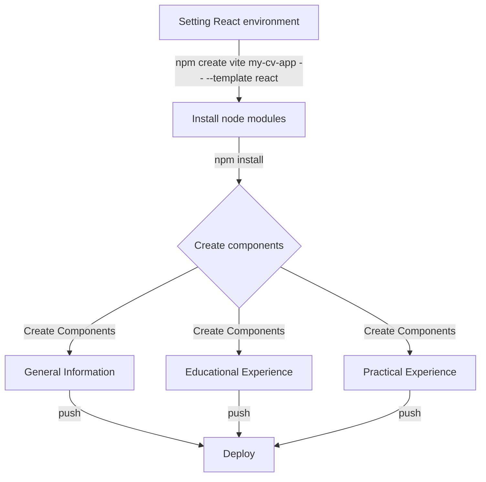

# flow-chart-build-react-app

The process of creating CV/resume apps with Reactjs is depicted in the flow chart above.
1. Begin by creating a new React project.

2. Consider how to divide the application into components. The following information should be included in the application:
  - A section for entering general information such as name, email, and phone number.
  - A space for adding educational experience (name of school, title of study, and date of study).
  - A part must include practical experience (business name, position description, primary tasks of our positions, dates from and till we worked for that company).

3. Ensure that every section of the CV, or the entire document, has an edit and submit button. Input field values in HTML elements should be displayed by the submit button, which also submits the form. The input fields should be added back (displayed) with the previously shown data as values when the edit button is pressed. We should be allowed to update and resubmit the material in those input fields. Make sure you comprehended the ideas of state and props, as we will be utilizing them extensively.

4. Under our src directory, make a components directory and add the components to it.

5. Add a styles directory to the CSS files' source directory. To use these, we must import them into the component files.

6. Push the project and deploy it.
